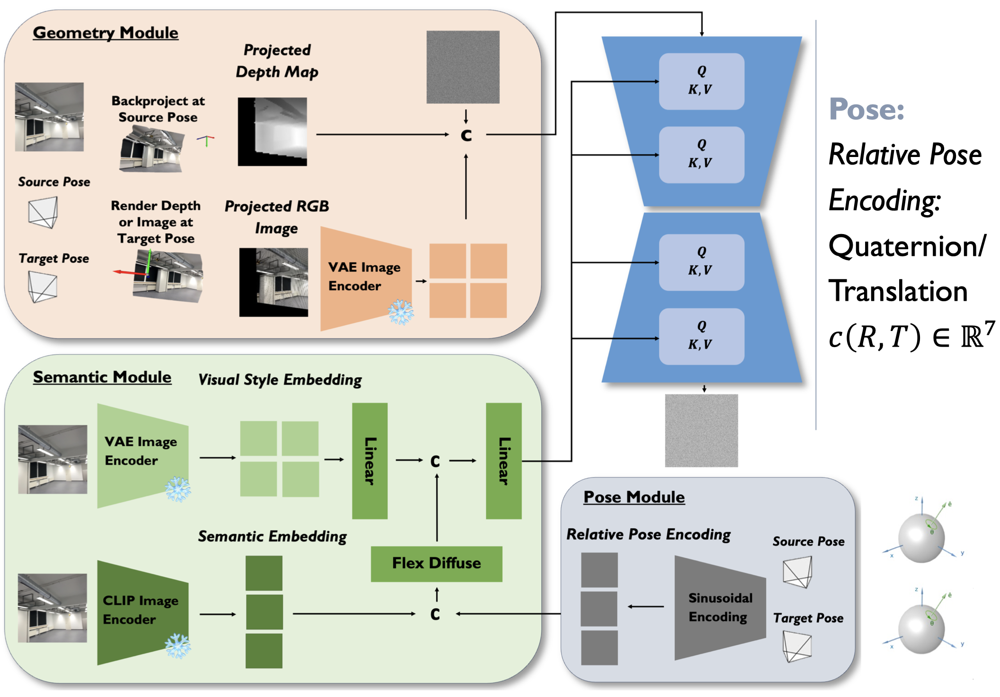

<p align="center">
  <h1 align="center">Novel View Synthesis for Scenes in the Wild</h1>
  <p align="center">
    <a href="https://github.com/michaelnoi/">Michal Neumayr</a><sup></sup></span>,
    <a href="https://github.com/TimAlexander">Tim Tomov</a><sup></sup></span>
    <br>
    <sup></sup>Technical University of Munich
    <!-- <sup></sup>equal contribution -->
  </p>
  <!-- <h2 align="center">Advanced Deep Learning for Visual Computing by Prof. Nießner's Lab</h2> -->
  <h3 align="center"><a href="https://github.com/michaelnoi/scene_nvs">Code</a> | <a href="assets/report.pdf">Report</a> | <a href="assets/poster.pdf">Poster</a> </h3>
  <div align="center"></div>
</p>
<p align="center">
  
</p>

This is the repository for the project "Novel View Synthesis for Scenes in the Wild" as part of the course "Advanced Deep Learning for Visual Computing" by Prof. Nießner's chair.
We propose a novel combination of local as well as global conditioning modules with which we finetune Stable Diffusion on the <a href="assets/architecture.png">ScanNet++</a> dataset.

## 1. Set up wandb (https://docs.wandb.ai/quickstart)

Sign up for a free account and login to your wandb account.

```
wandb login
```

Paste the API key from https://wandb.ai/authorize when prompted.

## 2. Download the <a href=https://kaldir.vc.in.tum.de/scannetpp/> dataset</a>

Register on the website and follow the download script.

## 3. Set up the environment

Clone repository and set up virtual environment.

```
git clone https://github.com/michaelnoi/scene_nvs.git
cd scene_nvs
```

```
pyenv virtualenv 3.10.10 nvs
pyenv local nvs
```

Install packages with poetry.

```
poetry install
```
